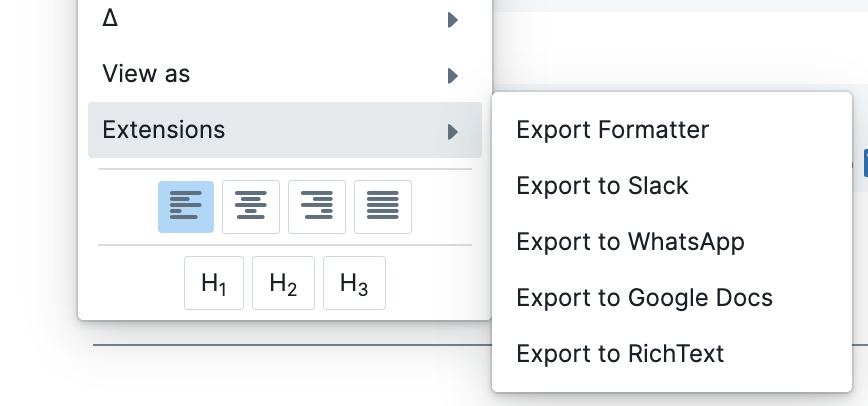

<p align="center">
   <a href="https://github.com/avelino/roamresearch-export-block" alt="Roam Export Block GitHub repository" target="_blank">
      
   </a>
</p>

# Roam Export Block

A Roam Research extension that exports blocks (together with their children) to multiple formats, keeping the structure and formatting ready to paste into other applications.

**Inspired by [logseq-export-block](https://github.com/avelino/logseq-export-block)** - A similar plugin for Logseq that served as the foundation for this Roam Research adaptation.

## Features

- Export Roam blocks with their children to multiple formats
- Maintain formatting and indentation appropriate for each target platform
- Copy directly to clipboard for easy pasting
- Support for rich text formatting where applicable
- Available directly from the block context menu

## Supported Export Formats

- **Slack**: Optimized formatting for Slack messages with proper link conversion and Slack-specific syntax
- **WhatsApp**: Clean formatting that works well with WhatsApp's limited markup
- **Google Docs**: Rich text formatting for better document integration
- **Rich Text**: General purpose rich text export

## Installation

1. Open Roam Research and navigate to the **Roam Depot**.
2. Search for **"Roam Export Block"** (or load the bundle manually if developing locally).
3. Install/enable the extension.

## Usage

1. Right-click on any block in Roam Research
2. From the context menu, select one of the export options:
   - `Export to Slack`
   - `Export to WhatsApp`
   - `Export to Google Docs`
   - `Export to RichText`
3. The block and its children will be copied to your clipboard in the selected format
4. Paste the content into your target application



## How It Works

The extension processes your Roam blocks and their children, applying format-specific transformations:

- Converts Roam markdown-style formatting to the appropriate syntax for each platform
- Handles links, lists, and indentation according to each platform's requirements
- For rich text formats (Slack, Google Docs), provides both plain text and HTML versions for better pasting results
- Uses modern clipboard APIs with fallbacks for maximum compatibility

## Development

This extension is built with TypeScript using Vite as the build tool and integrates directly with the Roam Research API.

### Building from source

```bash
# Install dependencies
npm install

# Build the extension
npm run build
```

The compiled bundle is emitted in `dist-export-block/extension.js`, ready to be loaded by Roam Depot or injected via the Roam `custom` JS settings.

### Development server

```bash
# Start development server with hot reload
npm run dev
```

## License

Created by [@avelino](https://github.com/avelino)
